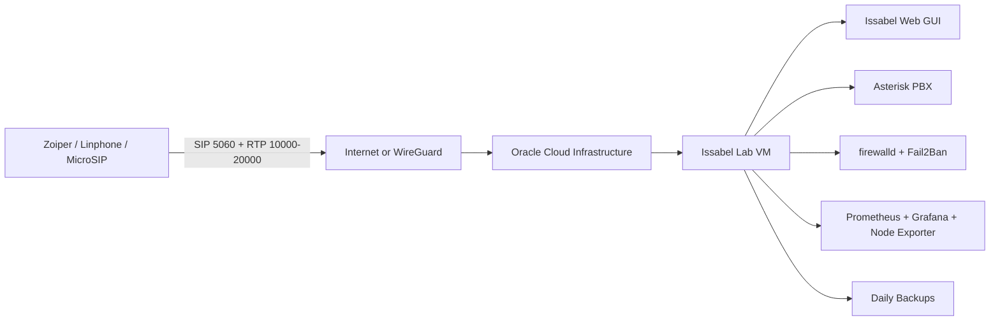

# Architecture

## Components

Terraform:

- Creates the network and VM repeatably.
- Restricts inbound traffic by CIDR.
- Adds swap through cloud-init for tiny free-tier hosts.

Ansible:

- Installs host packages and security services.
- Stages the Issabel 5 netinstall script.
- Configures Asterisk custom files for the lab.
- Installs backup and metrics timers.

Issabel:

- Provides the PBX web interface and integrated Asterisk stack.
- Gives a realistic environment for learning FreePBX-style PBX administration.

Asterisk:

- Handles SIP/PJSIP registration, dialplan routing, voicemail, transfers, call recording, and CDR.

Fail2Ban:

- Watches SSH and Asterisk logs.
- Blocks repeated authentication failures.

firewalld:

- Enforces host-level port restrictions.
- Complements OCI security lists.

Prometheus and Grafana:

- Prometheus stores metrics.
- Grafana visualizes CPU, memory, disk, and Asterisk health.
- Node Exporter exposes OS metrics.

WireGuard:

- Optional private path for SIP clients and admin access.
- Reduces public SIP exposure.

Dynamic DNS and Let's Encrypt:

- Dynamic DNS keeps the PBX reachable if the public IP changes.
- Let's Encrypt provides HTTPS for the web GUI.

Backups:

- Daily systemd timer archives PBX config, voicemail, recordings, CDR, and hardening files.
- Restore script rehydrates the files and restarts services.
