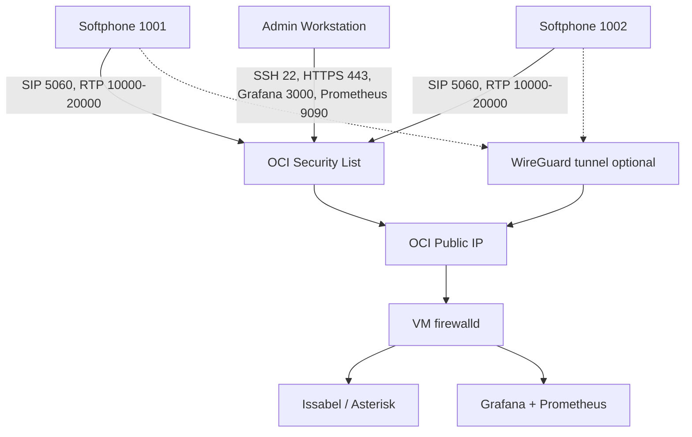

# Network Diagram



## Port Plan

| Port | Protocol | Purpose | Recommended source |
|---:|---|---|---|
| 22 | TCP | SSH | Admin IP only |
| 80 | TCP | HTTP and ACME | Admin IP, temporarily public for Let's Encrypt if needed |
| 443 | TCP | Issabel HTTPS | Admin IP or VPN |
| 5060 | UDP/TCP | SIP signaling | Softphone IP or VPN only |
| 10000-20000 | UDP | RTP audio | Softphone IP or VPN only |
| 51820 | UDP | WireGuard | Admin/peer IP when possible |
| 3000 | TCP | Grafana | Admin IP or SSH tunnel |
| 9090 | TCP | Prometheus | Admin IP or SSH tunnel |
| 9100 | TCP | Node Exporter | Localhost only with current compose design |

## NAT Notes

Public cloud VoIP commonly fails because SIP signaling and RTP media advertise private addresses. Set one of these in `ansible/group_vars/issabel.yml`:

```yaml
asterisk_public_ip: "<PUBLIC_IP>"
```

or:

```yaml
asterisk_external_host: "pbx.example.com"
```

Also keep:

```yaml
asterisk_local_net: "10.60.0.0/16"
```

matching the Terraform VCN CIDR.
